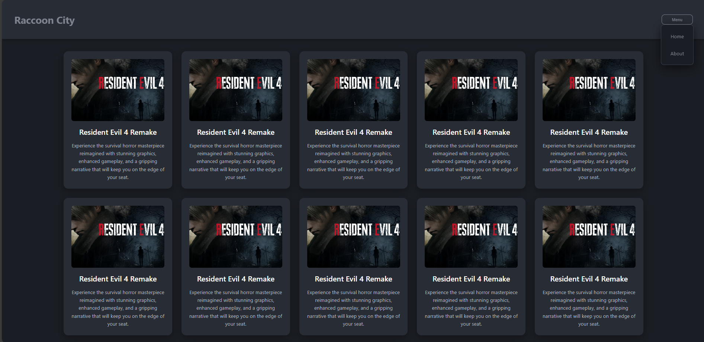

# 🕹️ Dynamic Navigation Dropdown - Interactive UI Components

## 📸 Website Preview

<div align="center">



</div>

<div align="center">

> *Modern responsive website featuring dynamic dropdown navigation with Resident Evil 4 themed content and interactive cards*

</div>

---

## 📋 Table of Contents
- [📋 Project Overview](#-project-overview)
- [✨ Features](#-features)
- [🛠️ Technologies Used](#️-technologies-used)
- [📁 Project Structure](#-project-structure)
- [🎨 Design Features](#-design-features)
- [🚀 Getting Started](#-getting-started)
- [🎯 Key Features](#-key-features)
- [📱 User Experience](#-user-user-experience)
- [🌟 Special Thanks](#-special-thanks)

---

## 📋 Project Overview

**Dynamic Navigation Dropdown** is a modern, interactive website featuring a responsive header with dropdown navigation and a grid of Resident Evil 4 themed content cards. Built with HTML and vanilla JavaScript, this project demonstrates advanced DOM manipulation, responsive design, and modern UI/UX principles.

---

## ✨ Features

### 🎯 **Interactive Navigation System**
- Responsive header with dynamic dropdown menu
- Mobile-first responsive design
- Smooth dropdown animations and transitions
- Click-outside-to-close functionality
- Dynamic menu state management

### 🎨 **Beautiful User Interface**
- Dark theme with modern color scheme
- Resident Evil 4 themed content
- Interactive card grid layout
- Smooth hover effects and animations
- Professional typography and spacing

### 📱 **Responsive Design**
- Mobile-responsive navigation
- Adaptive layout for all screen sizes
- Touch-friendly interface
- Cross-device compatibility
- Flexible grid system

### 🎮 **Content Management**
- Dynamic card generation
- Resident Evil 4 game information
- Professional image handling
- Consistent styling system
- Scalable content structure

### 🚀 **Advanced Functionality**
- DOM manipulation with vanilla JavaScript
- Event-driven architecture
- Smooth CSS transitions
- Professional hover effects
- Cross-browser compatibility

## 🛠️ Technologies Used

- **HTML5** - Semantic markup and structure
- **Vanilla JavaScript** - DOM manipulation and event handling
- **CSS-in-JS** - Dynamic styling with JavaScript
- **Responsive Design** - Mobile-first approach
- **Modern UI/UX** - Professional appearance and interactions

## 📁 Project Structure

```
AlhussienHazem-Task-8/
├── index.html          # Main website interface
├── script.js           # Dynamic navigation and content
├── style.css           # Additional styling (if any)
├── README.md           # This file
└── re4.jpg            # Resident Evil 4 image
```

---

## 🎨 Design Features

- **Dark Theme** - Professional dark color scheme
- **Dynamic Navigation** - Responsive header with dropdown
- **Card-based Layout** - Clean, organized content presentation
- **Interactive Elements** - Hover effects and smooth transitions
- **Professional Typography** - Clear, readable text hierarchy
- **Resident Evil 4 Theme** - Gaming-focused content and styling

---

## 🚀 Getting Started

1. **Clone the repository**
   ```bash
   git clone https://github.com/alhussienhazem/raccoon-city-portal.git
   ```

2. **Navigate to the project directory**
   ```bash
   cd AlhussienHazem-Task-8
   ```

3. **Open in your browser**
   - Open `index.html` in your web browser
   - Test the responsive navigation on different screen sizes
   - Click the Menu button to see the dropdown in action

---

## 🎯 Key Features

- ✅ **Dynamic Navigation** - Responsive header with dropdown menu
- ✅ **Mobile Responsive** - Adapts to all screen sizes
- ✅ **Interactive Dropdown** - Smooth animations and transitions
- ✅ **Content Cards** - Dynamic generation with Resident Evil 4 theme
- ✅ **Modern UI/UX** - Professional appearance and interactions
- ✅ **Vanilla JavaScript** - Pure JS without external dependencies
- ✅ **Cross-browser Compatible** - Works in all modern browsers

---

## 📱 User Experience

### 🎨 **Visual Design**
- **Dark theme** - Professional dark color scheme
- **Responsive header** - Adapts to screen size
- **Dropdown navigation** - Clean, organized menu system
- **Content cards** - Resident Evil 4 themed information
- **Hover effects** - Interactive feedback on user actions

### 🎮 **Navigation Flow**
1. **Website loads** - Beautiful dark interface with header
2. **Responsive behavior** - Navigation adapts to screen size
3. **Dropdown interaction** - Click Menu button to open dropdown
4. **Content exploration** - Browse Resident Evil 4 themed cards
5. **Mobile experience** - Touch-friendly interface on small screens

### 🎯 **Learning Benefits**
- **DOM manipulation** - Creating and styling elements dynamically
- **Responsive design** - Mobile-first development approach
- **Event handling** - Click events and user interactions
- **CSS-in-JS** - Dynamic styling with JavaScript
- **Modern UI/UX** - Professional interface design principles

---


## 🌟 Special Thanks

- **Instructor Badr** - For assigning this comprehensive UI development task
- **Modern web standards** - For enabling responsive design
- **Vanilla JavaScript** - For powerful DOM manipulation capabilities
- **Resident Evil 4** - For inspiring the themed content

---

*Built with ❤️ for learning dynamic UI development and modern web design principles*
